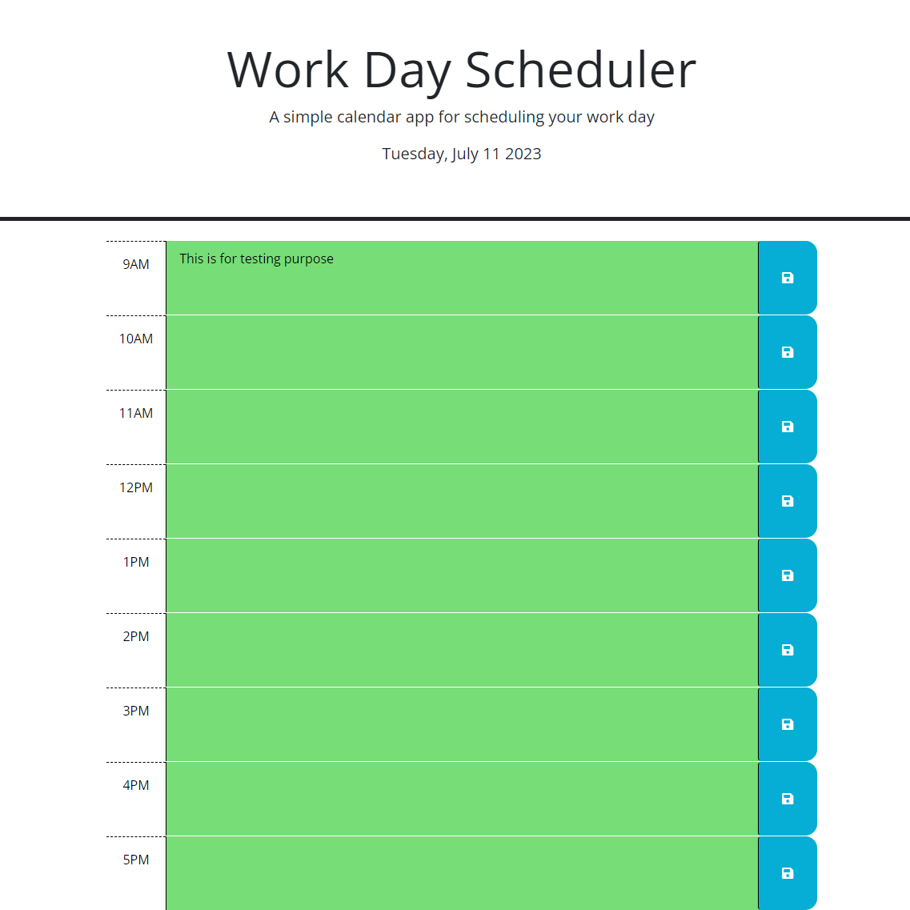

# Work-Day-Planner

## Description

A simple day planner to schedule out your work day by allowing users to save events for each hour block of a typical work day. This was made by modifying starter code and adding JavaScript for functionality.

This project uses the following libraries:

* Jquery
* DayJS
* Bootstrap
* Font Awesome
* Google Fonts

## Display 

Below you will find a screenshot of the website's display:

## Installation

N/A

## Usage

[Visit the Page Here.](https://rdheadyii.github.io/Work-Day-Planner/)

## Credits

N/A

## License

N/A